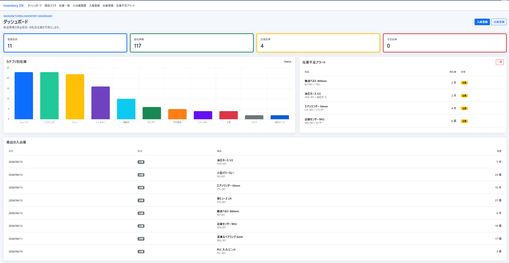
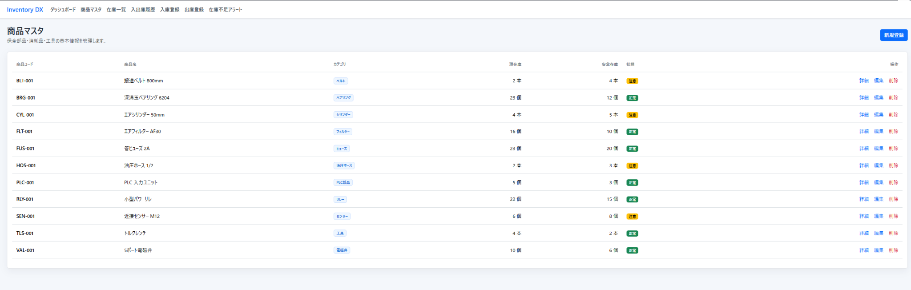
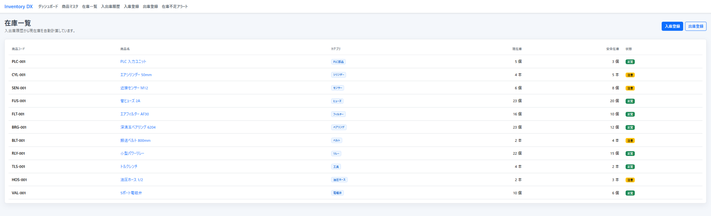
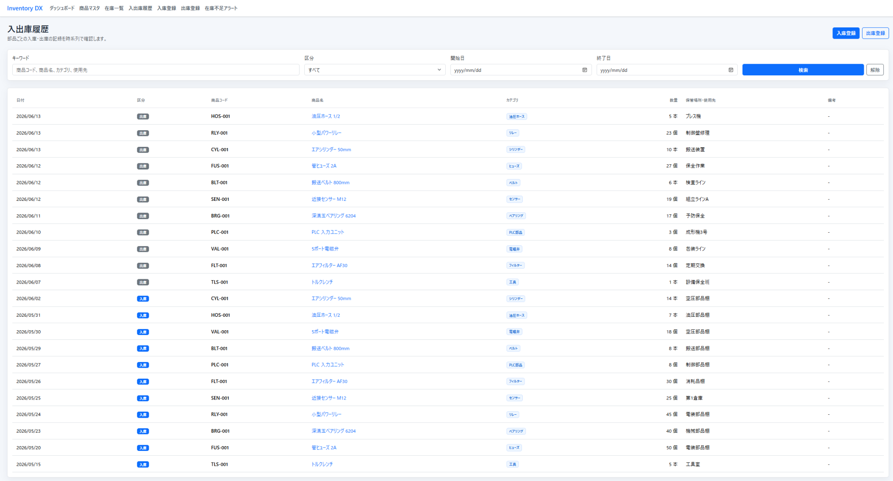
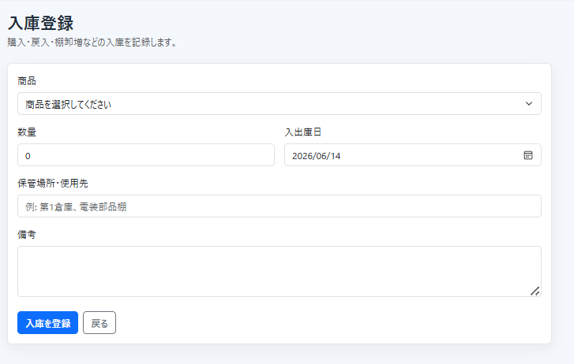
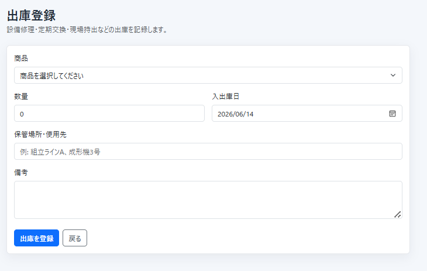
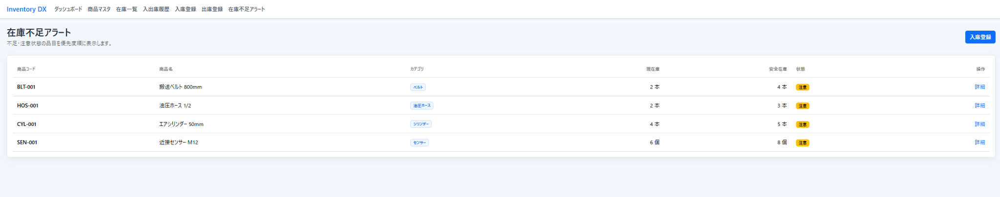
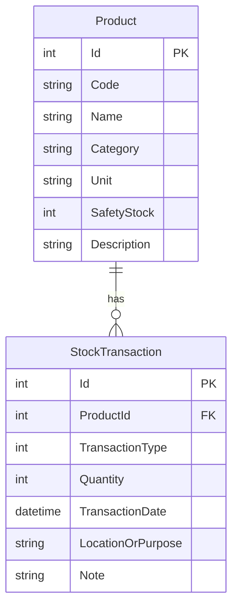

# Inventory Management System


製造業の保全部品・消耗品・工具を管理するための在庫管理システムです。
商品マスタ、入庫、出庫、在庫一覧、入出庫履歴、在庫不足アラート、ダッシュボードを備えたWebアプリケーションとして実装しています。

## システム概要

製造現場では、保全部品や消耗品を紙やExcelで管理しているケースが多く、在庫不足や管理漏れが設備停止、復旧遅延、余剰在庫につながります。

このシステムは、保全部品・消耗品・工具の在庫情報をWeb上で一元管理し、入出庫履歴から現在庫を自動計算することで、現場の在庫状況をすばやく把握できるようにするMVPです。

特に以下の課題を解決することを目的としています。

- 部品の在庫不足
- 保全部品の管理漏れ
- 手書き管理による転記ミス
- 入出庫履歴の追跡困難
- 安全在庫の見落とし

## 主な機能

- ダッシュボード
- 商品マスタ管理
- 在庫一覧
- 入庫登録
- 出庫登録
- 入出庫履歴
- 在庫不足アラート
- カテゴリ別在庫グラフ

## 技術スタック

| 分類 | 技術 |
|---|---|
| Framework | ASP.NET Core Razor Pages |
| Language | C# |
| ORM | Entity Framework Core |
| Database | SQLite |
| Frontend | Bootstrap 5 |
| Chart | Chart.js |
| Version Control | Git / GitHub |

## システム構成


Razor Pagesで画面表示とフォーム入力を受け付け、在庫集計や在庫不足判定は`InventoryService`に集約しています。データアクセスはEntity Framework Coreを通してSQLiteへ永続化します。

## 画面一覧

### ダッシュボード



登録品目数、総在庫数、注意在庫数、不足在庫数をKPIとして表示します。カテゴリ別在庫グラフ、在庫不足品目、直近の入出庫履歴を1画面で確認できます。

### 商品マスタ



商品コード、商品名、カテゴリ、単位、安全在庫を一覧管理します。商品ごとの現在庫と在庫状態も確認でき、マスタ管理と在庫確認を同じ画面で行えます。

### 在庫一覧



入庫・出庫履歴から現在庫を自動計算し、商品ごとの在庫数、安全在庫、ステータスを表示します。現場担当者が不足品目をすばやく把握できる画面です。

### 入出庫履歴



入庫・出庫の履歴を時系列で確認できます。キーワード、区分、日付範囲で絞り込み、いつ、どの部品が、どれだけ動いたかを追跡できます。

### 入庫登録



商品、数量、入庫日、保管場所、備考を入力して入庫を登録します。購入品や補充品が現場に入ったタイミングで記録できます。

### 出庫登録



商品、数量、出庫日、使用先、備考を入力して出庫を登録します。設備修理や交換作業で使用した部品の履歴を残せます。

### 在庫不足アラート



現在庫が0、または安全在庫以下になった品目を一覧表示します。補充が必要な品目を優先的に確認でき、発注漏れや欠品リスクの低減につながります。

## データベース設計

### Product

商品マスタを表すテーブルです。

- Id
- Code
- Name
- Category
- Unit
- SafetyStock
- Description

### StockTransaction

入庫・出庫履歴を表すテーブルです。

- Id
- ProductId
- TransactionType
- Quantity
- TransactionDate
- LocationOrPurpose
- Note

### ER図



## 在庫計算ロジック

現在庫は、商品ごとの入庫数量合計から出庫数量合計を差し引いて算出します。

```text
現在庫 = 入庫合計 - 出庫合計
```

在庫状態は現在庫と安全在庫を比較して判定します。

```text
CurrentStock <= 0           -> OutOfStock
CurrentStock <= SafetyStock -> LowStock
その他                      -> Normal
```

- `OutOfStock`: 在庫切れ
- `LowStock`: 安全在庫以下
- `Normal`: 通常在庫

## ローカル実行手順

```bash
git clone https://github.com/Ai-Chanbo/inventory-management-system.git
cd inventory-management-system
dotnet restore
dotnet run
```

起動後、ブラウザで以下のURLにアクセスします。

```text
http://localhost:5130
```

初回起動時にSQLiteデータベース`inventory.db`が作成され、サンプルデータが投入されます。

## 今後の拡張案

Version 2候補として、以下の機能追加を想定しています。

- 認証機能
- ロール管理
- CSVインポート
- CSVエクスポート
- バーコード対応
- QRコード対応
- 発注管理
- 仕入先管理
- PDF出力
- Docker対応
- REST API化

## 開発者情報

開発者: 玉置 大和

GitHub: [https://github.com/Ai-Chanbo](https://github.com/Ai-Chanbo)

専門領域:

- 製造業DX
- C#
- .NET
- PLC
- 設備保全
- AI外観検査
- IoT
